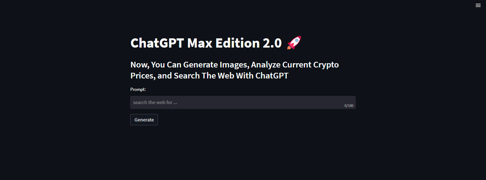
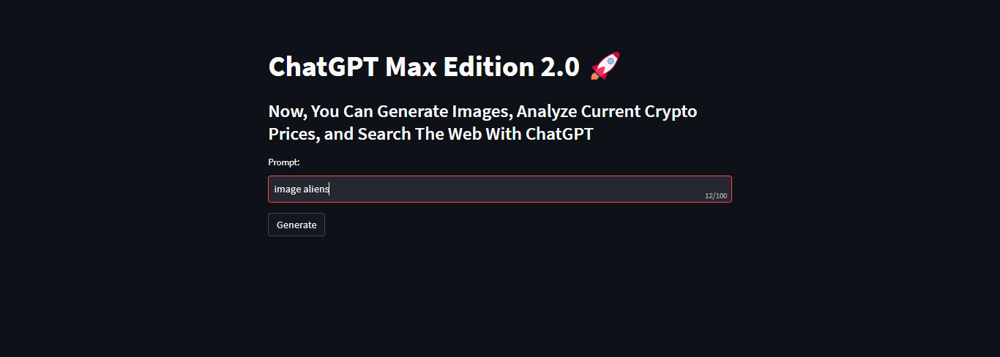
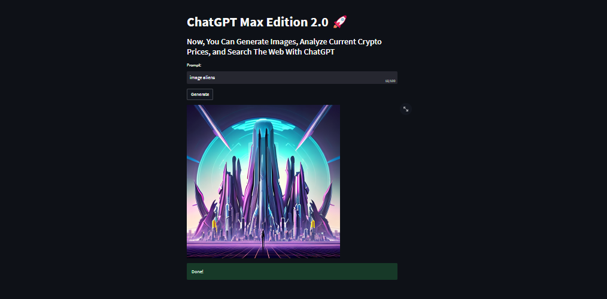
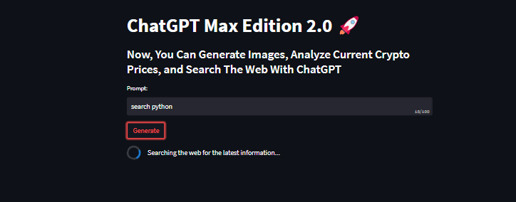
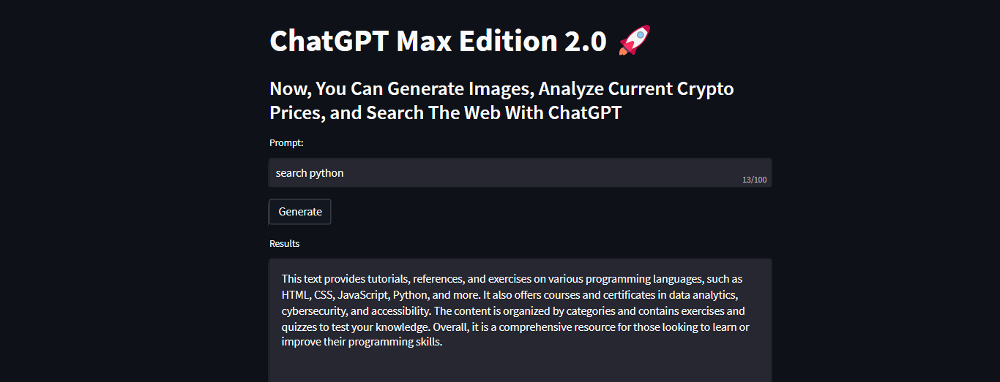
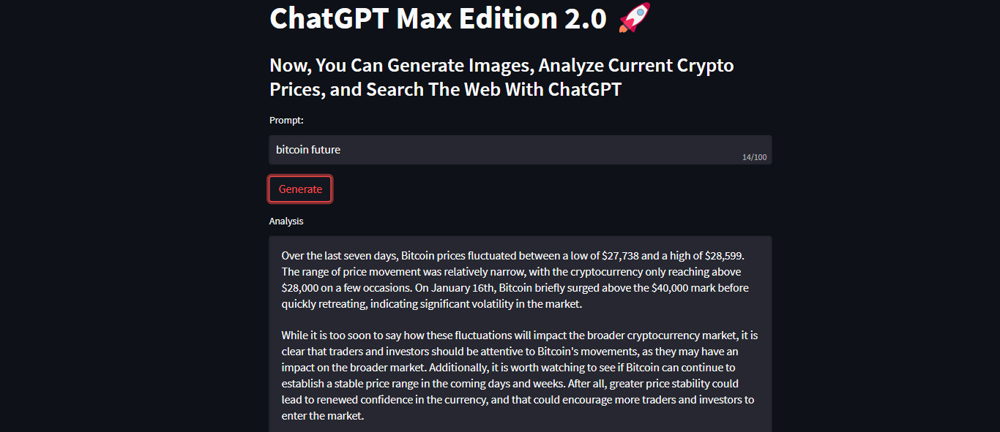

# App 1: AI Research Assistant
Description: The AI Research Assistant is a Python script that utilizes OpenAI's GPT-3.5 model to assist with various research tasks. The app has three main functionalities: Bitcoin price analysis, web search summarization, and image generation. The Bitcoin price analysis feature extracts the last seven days of Bitcoin price data from Coinranking and asks ChatGPT to provide a brief analysis of what the data could mean for the cryptocurrency market. The web search summarization feature utilizes Google search to find the top-ranked webpage for a given query and then asks ChatGPT to summarize the webpage's content. The image generation feature prompts ChatGPT to generate a series of images based on user-provided input.

## Screenshots
[

]
[

]
[

]
[

]
[

]
[

]

## Usage Instructions:
1.	Install the required Python libraries by running pip install -r requirements.txt in the terminal.
2.	Make sure you have a valid OpenAI API key and organization ID. You can get one by signing up at https://openai.com/.
3.	Open the app.py file and replace YOUR_API_KEY and YOUR_ORG_ID with your OpenAI API key and organization ID, respectively.
4.	Run the script by running streamlit run app.py in the terminal.
5.	Choose one of the three functionalities (Bitcoin price analysis, web search summarization, or image generation) from the dropdown menu.
6.	Follow the prompts to input the necessary data for each functionality.
7.	Wait for the AI to generate the output.
8.	Enjoy!