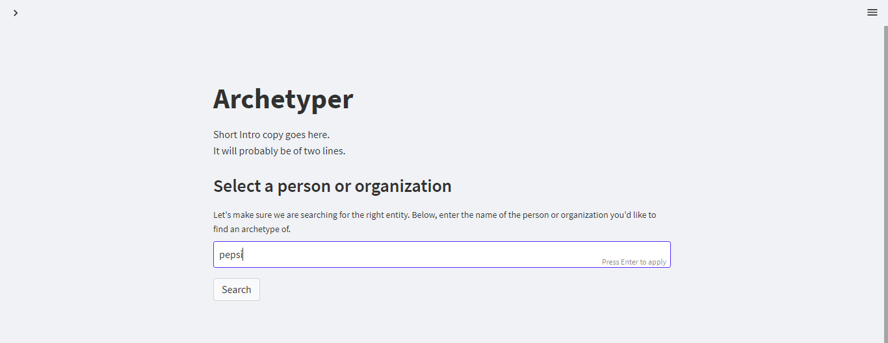
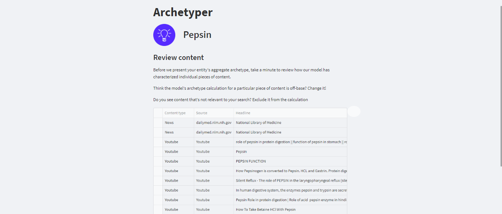
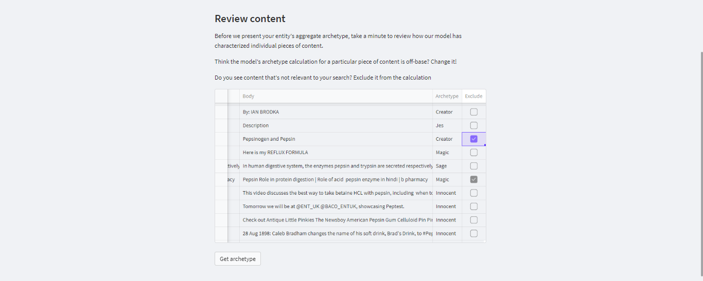
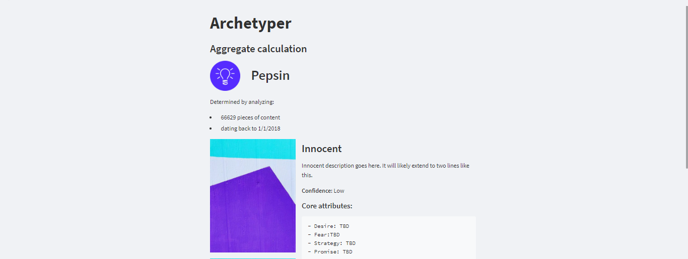
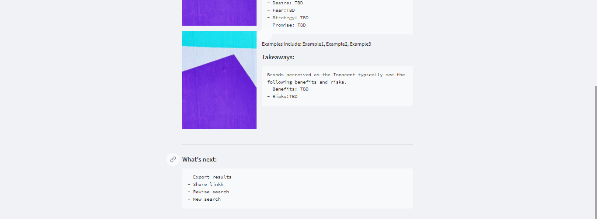

# App 1: Archetyper
## Description:
The Archetyper app is a Python-based application developed for the Streamlit platform that provides users with a user-friendly interface to search for news articles relating to a particular organization or person and analyze the content using advanced Natural Language Processing (NLP) tools. The app utilizes several data sources, including YouTube, Twitter, Reddit, the Event Registry API, and the NLP Cloud API, to fetch news articles and generate archetypes for each article.

The Streamlit interface provides a simple search bar where users can enter the name of the organization or person they want to analyze. The app then uses the various data sources to retrieve news articles matching the search term and presents them in a tabular format, enabling users to select and display the articles of interest. The app's multi-source approach ensures a diverse range of news articles, giving users a broad and complete view of the topic at hand.

The app allows users to view the generated archetypes for each news article. The archetypes provide a representation of the underlying meaning and character of the text, helping users to analyze and understand the content of the news articles. The app uses advanced NLP tools to generate archetypes for the selected news articles, providing users with a deeper understanding of the underlying meaning and themes of each article.

The Archetyper app is designed to be user-friendly and intuitive. It features a dynamic data editor that allows users to make changes to the content of the fetched news articles and remove any irrelevant information. The app then generates a final DataFrame without the excluded rows, which is used to compute the archetypes for the selected news articles. This feature enables users to customize the content they want to analyze and ensures that the generated archetypes are based on the relevant information.

The app also features Streamlit extras switch_page_button, enabling users to navigate through different pages of the app, such as the search page, the fetched news article display page, and the archetype analysis page. This feature provides users with an intuitive and easy-to-use interface to navigate through the app's different functionalities.

In summary, the Archetyper app provides a simple and efficient way for users to search and analyze news articles related to a particular organization or person using advanced NLP tools, making it an essential tool for journalists, researchers, and analysts. Its user-friendly interface and advanced features make it a valuable asset for anyone looking to understand the underlying themes and meaning of news articles related to a particular topic.

## Screenshots
- 

- 

- 

- 

- 

- 

- 

- 

## Usage Instructions:

Here are instructions on how to set up the Archetyper Streamlit app:
1.	Clone the repository containing the app's code from GitHub onto your local machine.
2.	Navigate to the directory containing the app's code in your terminal.
3.	Install the necessary dependencies for the app by running the following command:
`pip install -r requirements.txt`
4.	Set up an account with the Event Registry API and obtain an API key.
5.	Set up an account with the NLP Cloud API and obtain an API key.
6.	In the config.py file, replace the placeholders for the API keys with the actual keys you obtained.
7.	Run the app by running the following command in your terminal:
`streamlit run app.py`
8.	Open your browser and navigate to the local URL provided by Streamlit to use the app.

Once the app is running, you can follow these steps to use it:
1.	Enter the name of the organization or entity you want to analyze in the search bar provided on the app's home page.
2.	Click the "Search" button to retrieve the concepts related to the input name.
3.	Select the scope of search from the available options: News articles, Social (Youtube, Twitter, Reddit), or Manual.
4.  Enter Manual content if you have selected in the previous window.
5.	Click the "Get archetype" button to analyze the content fetched from the selected domains and generate archetypes for them.
6.	View the generated archetypes for each news article on the archetype analysis page. You can switch between the search page, the fetched news article display page, and the archetype analysis page using the navigation buttons provided on the app.
7.	Edit the fetched news articles using the dynamic data editor provided on the fetched news article display page to remove any irrelevant information before generating the archetypes.

That's it! With these instructions, you should be able to set up and use the Archetyper Streamlit app with ease.

You can access the development version of the app here:
https://faisal-saddique-archetyper-archetyper-bbt8be.streamlit.app/

# App 2: AI Research Assistant
## Description:
The AI Research Assistant is a Python script that utilizes OpenAI's GPT-3.5 model to assist with various research tasks. The app has three main functionalities: Bitcoin price analysis, web search summarization, and image generation. The Bitcoin price analysis feature extracts the last seven days of Bitcoin price data from Coinranking and asks ChatGPT to provide a brief analysis of what the data could mean for the cryptocurrency market. The web search summarization feature utilizes Google search to find the top-ranked webpage for a given query and then asks ChatGPT to summarize the webpage's content. The image generation feature prompts ChatGPT to generate a series of images based on user-provided input.

## Screenshots
- 

- 

- 

- 

- 

- 

## Usage Instructions:
1.	Install the required Python libraries by running pip install -r requirements.txt in the terminal.
2.	Make sure you have a valid OpenAI API key and organization ID. You can get one by signing up at https://openai.com/.
3.	Open the app.py file and replace YOUR_API_KEY and YOUR_ORG_ID with your OpenAI API key and organization ID, respectively.
4.	Run the script by running streamlit run app.py in the terminal.
5.	Choose one of the three functionalities (Bitcoin price analysis, web search summarization, or image generation) from the dropdown menu.
6.	Follow the prompts to input the necessary data for each functionality.
7.	Wait for the AI to generate the output.
8.	Enjoy!

You can access the development version of the app here:
https://odongo12-gptmax2-app-users-78ucj4.streamlit.app/